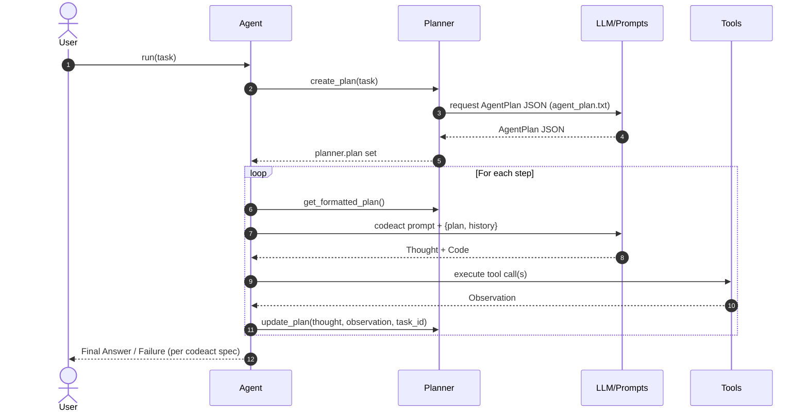

# 🤖 KodeAgent

KodeAgent: A minimalistic approach to building AI agents.

[](https://img.shields.io/pypi/v/kodeagent.svg)
[](https://codecov.io/gh/barun-saha/kodeagent)
[](https://kodeagent.readthedocs.io/en/latest/?badge=latest)
[](https://opensource.org/licenses/Apache-2.0)


## ✅ Why KodeAgent?

Use KodeAgent because it is:

- **Frameworkless**: Unlike some heavy agentic frameworks, KodeAgent is lightweight, making it easy to integrate and extend.
- **Learn-first design**: Helps developers understand agent-building from scratch, focusing on the agent loop and various data structures.
- **Multimodal**: Supports both text and images in the inputs. 

Consisting of only ~2000 lines (excluding the prompts), KodeAgent comes with built-in [ReAct](https://arxiv.org/abs/2210.03629) and [CodeAct](https://arxiv.org/abs/2402.01030) agents. Or you can create your own agent by subclassing `Agent`. The ReAct and CodeAct agents are supported by `Planner` and `Observer`.

A key motivation behind KodeAgent is also to teach building agent-like frameworks from scratch. KodeAgent introduces a few primitives and code flows that should help you get an idea about how such frameworks typically work.

KodeAgent is stateless. It is generally suitable for use as part of larger systems to execute specific tasks.


## ✋ Why Not?

Also, here are a few reasons why you shouldn't use KodeAgent:

- KodeAgent is actively evolving, meaning some aspects may change.
- The priority of KodeAgent is simplicity; optimization is secondary.
- You want to use some of the well-known frameworks.


## 👨‍💻 Usage

<a target="_blank" href="https://colab.research.google.com/drive/1D9ly3qi9sPZn_sUFdfC1XCFehldCVPXM?usp=sharing">
  
</a>


Install [KodeAgent](https://pypi.org/project/kodeagent/) via pip:
```bash
pip install kodeagent
```

Or if you want to clone the KodeAgent GitHub repository locally and run from there, use:
```bash
git clone https://github.com/barun-saha/kodeagent.git

python -m venv venv
source venv/bin/activate
# venv\Scripts\activate.bat  # Windows

pip install -r requirements.txt
```

Now, in your application code, create a ReAct agent and run a task like this:
```python
from kodeagent import ReActAgent, print_response, extract_file_contents_as_markdown, search_web


agent = ReActAgent(
    name='Web agent',
    model_name='gemini/gemini-2.5-flash-lite',
    tools=[search_web, extract_file_contents_as_markdown],
    max_iterations=7,
)

for task in [
    'What are the festivals in Paris? How they differ from Kolkata?',
]:
    print(f'User: {task}')

    async for response in agent.run(task):
        print_response(response, only_final=True)
```

You can also create a CodeAct agent:

```python
from kodeagent import CodeActAgent, search_web, extract_file_contents_as_markdown


agent = CodeActAgent(
    name='Web agent',
    model_name='gemini/gemini-2.5-flash-lite',
    tools=[search_web, extract_file_contents_as_markdown],
    run_env='host',
    max_iterations=7,
    allowed_imports=['re', 'requests', 'duckduckgo_search', 'markitdown'],
    pip_packages='ddgs~=9.5.2;"markitdown[all]";',
)
```

That's it! Your agent should start solving the task and keep streaming the updates. For more examples, including how to provide files as inputs, see the [kodeagent.py](src/kodeagent/kodeagent.py) module.

KodeAgent uses [LiteLLM](https://github.com/BerriAI/litellm), enabling it to work with any capable LLM. Currently, KodeAgent has been tested with Gemini 2.5 Flash Lite. For advanced tasks, you can try Gemini 2.5 Pro.

LLM model names, parameters, and keys should be set as per [LiteLLM API Keys documentation](https://docs.litellm.ai/docs/set_keys). For example, set the `GEMINI_API_KEY` environment variable (add in the `.env` file you are running from source code) to use [Gemini API](https://aistudio.google.com/api-keys). Additionally, you can set `OPENAI_API_KEY` for OpenAI models; set `ANTHROPIC_API_KEY` for Claude models; and so on. For [Azure OpenAI](https://docs.litellm.ai/docs/providers/azure/) models, set `AZURE_API_KEY`, `AZURE_API_BASE`, and `AZURE_API_VERSION` environment variables.


### Code Execution

`CodeActAgent` executes LLM-generated code to leverage the tools. KodeAgent currently supports two different code run environments:
- `host`: The Python code will be run on the system where you created this agent. In other words, where the application is running.
- `e2b`:  The Python code will be run on an [E2B sandbox](https://e2b.dev/). You will need to set the `E2B_API_KEY` environment variable.

With `host` as the code running environment, no special steps are required, since it uses the current Python installation. However, with `e2b`, code (and tools) are copied to a different environment and are executed there. Therefore, some additional setup may be required.

For example, the Python modules that are allowed to be used in code should be explicitly specified using `allowed_imports`. In addition, any additional Python package that may need to be installed should be specified as a comma-separated list via `pip_packages`.  

KodeAgent is very much experimental. Capabilities are limited. Use with caution.


## 🛠️ Tools

KodeAgent comes with the following built-in [tools](src/kodeagent/tools.py):
- `calculator`: A simple calculator tool to perform basic arithmetic operations.
- `download_file`: A tool to download a file from a given URL.
- `extract_file_contents_as_markdown`: A tool to read file contents and return as markdown using MarkItDown.
- `get_audio_transcript`: A tool to transcribe audio files using OpenAI's Whisper via [Fireworks API](https://fireworks.ai/). Need to set the `FIREWORKS_API_KEY` environment variable.
- `get_youtube_transcript`: A tool to fetch YouTube video transcripts.
- `search_arxiv`: A tool to search arXiv for research papers and return summaries and links.
- `search_web`: A web search tool using DuckDuckGo to fetch top search results.
- `search_wikipedia`: A tool to search Wikipedia and return summaries and links.

Check out the docstrings of these tools in the [tools.py](src/kodeagent/tools.py) module for more details.

To add a new tool, use the `@tool` decorator from `kodeagent.tool` module. For example:
```python
from kodeagent import tool

@tool
def my_tool(param1: str) -> str:
    """Description of the tool.
    Args:
        param1 (str): Description of param1.
    Returns:
        str: Description of the return value.
    """
    # Tool implementation here
    return "result"
```

Module imports and all variables should be inside the tool function. If you're using `CodeActAgent`, KodeAgent will execute the tool function in isolation.
For further details, refer to the [API documentation](https://kodeagent.readthedocs.io/en/latest/).

## 🔭 Observability

KodeAgent logs the LLM calls and usage using [Langfuse](https://langfuse.com/). The LiteLLM calls set the trace ID to the task ID. The model name as well as the response format and retry attempts for the generations are also logged (see the screenshot below). To enable tracing, create your Langfuse account and set the `LANGFUSE_PUBLIC_KEY`, `LANGFUSE_SECRET_KEY`, and `LANGFUSE_HOST` environment variables. Read more about [Langfuse integration with LiteLLM](https://docs.litellm.ai/docs/observability/langfuse_integration).


## ⊷ Sequence Diagram for CodeAct Agent (via CodeRabbit)



# 🧪 Run Tests

To run unit tests, use:
```bash
python -m pytest .\tests\unit -v --cov --cov-report=html
```

The current test coverage is 86%.

For integration tests involving calls to APIs, use:
```bash
python -m pytest .\tests\integration -v --cov --cov-report=html
```

Gemini and E2B API keys should be set in the `.env` file for integration tests to work.

A [Kaggle notebook](https://www.kaggle.com/code/barunsaha/kodeagent-benchmark/) for benchmarking KodeAgent is also available.


## 🗺️ Roadmap & Contributions

To be updated.


## 🙏 Acknowledgement

KodeAgent heavily borrows code and ideas from different places, such as:
- [LlamaIndex](https://docs.llamaindex.ai/en/stable/examples/agent/react_agent/)
- [Smolagents](https://github.com/huggingface/smolagents/tree/main)
- [LangGraph](https://github.com/langchain-ai/langgraph)
- [Building ReAct Agents from Scratch: A Hands-On Guide using Gemini](https://medium.com/google-cloud/building-react-agents-from-scratch-a-hands-on-guide-using-gemini-ffe4621d90ae)
- [LangGraph Tutorial: Build Your Own AI Coding Agent](https://medium.com/@mariumaslam499/build-your-own-ai-coding-agent-with-langgraph-040644343e73)
