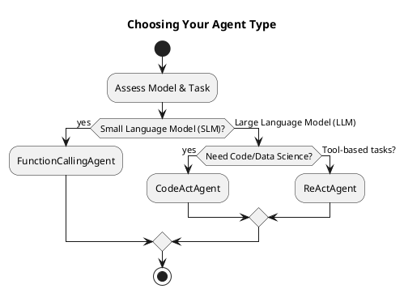
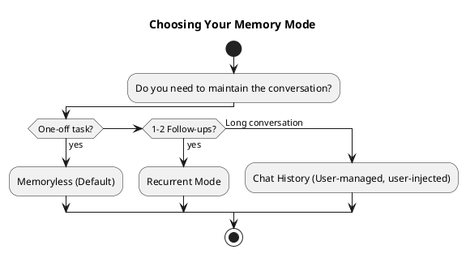

# Choosing the Right Agent

When you start building with KodeAgent, one of the first decisions you'll face is picking the right agent architecture. We've designed KodeAgent to be flexible, but that flexibility means you have a few knobs to turn to get the best performance out of your model. 

Depending on your task—whether it's a simple tool call or a complex data science problem—you'll want to choose an agent that matches the strengths of your LLM.

## The Three Agent Types

### 1. FunctionCallingAgent (FCA)
If you're working with **Small Language Models (SLMs)** that have native support for tool calling, this is your go-to. It's lean, efficient, and optimized for models that "just know" how to handle function signatures. It’s perfect when you need a snappy response and don't require the overhead of a complex reasoning loop.

### 2. ReActAgent
For most high-performance **Large Language Models (LLMs)**, ReAct is the ideal choice. Like the FCA, it works by using tools, but it captures much richer input and output information. It follows a "Reasoning + Acting" cycle, providing more observability into *why* the agent is making certain decisions. If you need a robust agent that can handle complex multi-step tasks with clear logs, ReAct is the way to go.

### 3. CodeActAgent
Sometimes, predefined tools aren't enough. If your task involves **data cleaning, building Machine Learning models, or anything that benefits from writing and executing code**, CodeAct is the right fit. Instead of relying on a toolbox of specific functions, CodeAct solves problems by writing and running Python code directly. It’s significantly more powerful for open-ended technical tasks where you can't predict every functionality you might need ahead of time.

---

## Managing Memory: Stateless by Default

By default, KodeAgent is memoryless. It treats every task as a fresh start, which is great for predictability and keeping costs down. However, when you need a conversation to flow, you can circumvent this in two ways:

### Recurrent Mode
This is a simple "context loop." It takes the description and result of your previous task and injects them into the current one. 
- **Best for:** One or two follow-up queries.
- **Pro Tip:** This works best when the previous task succeeded. If the first task failed, following up on it using recurrent mode might just carry over the confusion!

### Chat History Injection
For more complex interactions, KodeAgent allows you to inject a complete chat history (messages, tool calls, and outputs) directly into the LLM's prompt. 
- **Responsibility:** KodeAgent doesn't persist this history itself. It’s up to your application to save the conversation to a database and feed it back to the agent for the next turn.
- **Note:** This is mutually exclusive with Recurrent Mode. Use this when you need a true, long-form conversational experience.

---

## The Decision Flowchart

Use this flowchart to determine which combination of agent and memory mode fits your needs:

```text
       START: What is the primary task?
              |
      +-------+--------------------------+
      |                                  |
[Model Size?]                      [Task Complexity?]
      |                                  |
      +------------+                     +-------------+
      |            |                     |             |
    [SLM]        [LLM]             [Open-ended]    [Tool-based]
      |            |                (Data/ML)          |
      |            |                     |             |
      v            v                     v             v
[FunctionCalling]  +--------------> [CodeAct]       [ReAct]
                   |
            (Native Tools?)
```



```text
       NOW: Do you need to maintain the conversation?
              |
      +-------+--------------------------+
      |               |                  |
[One-off task]  [1-2 Follow-ups]   [Long conversation]
      |               |                  |
      v               v                  v
 [Memoryless]    [Recurrent]      [Chat History]
 (Default)                       (User-managed, user-injected)
```



---

## Summary Table

| Feature | FunctionCalling | ReAct | CodeAct |
| :--- | :--- | :--- | :--- |
| **Best Model** | SLMs (Native support) | LLMs | LLMs |
| **Execution** | Tool Calls | Reason + Tool Calls | Python Code |
| **Rich Logs** | Basic | High | High |
| **Best Use Case** | Fast API actions | Complex reasoning | Data Science / ML |
